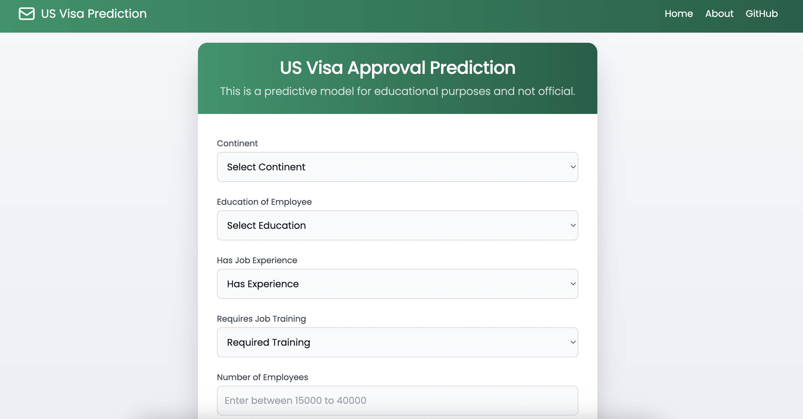
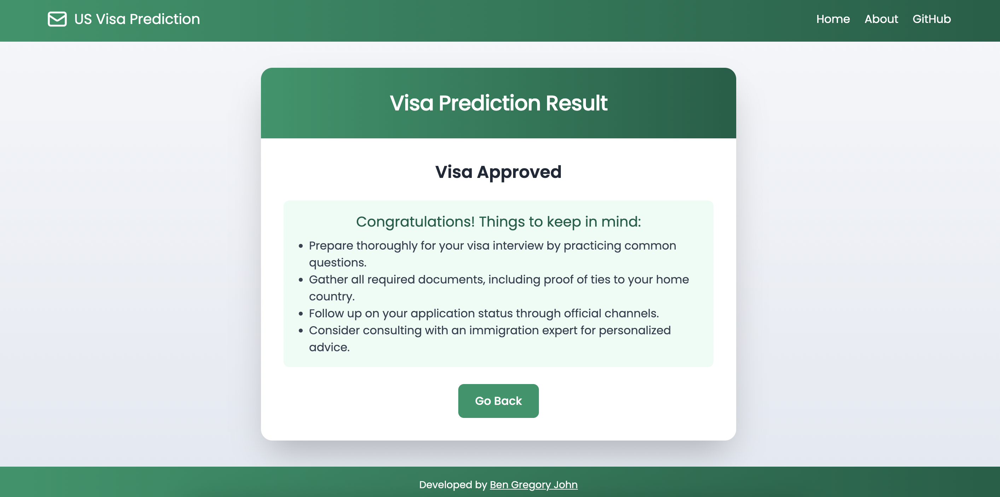
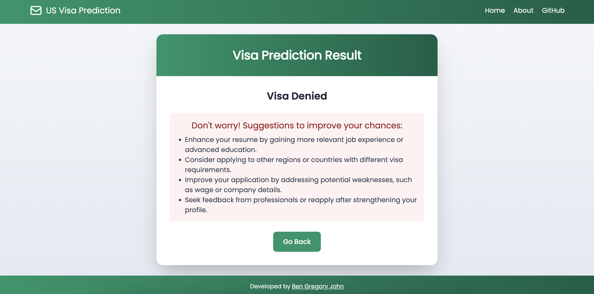
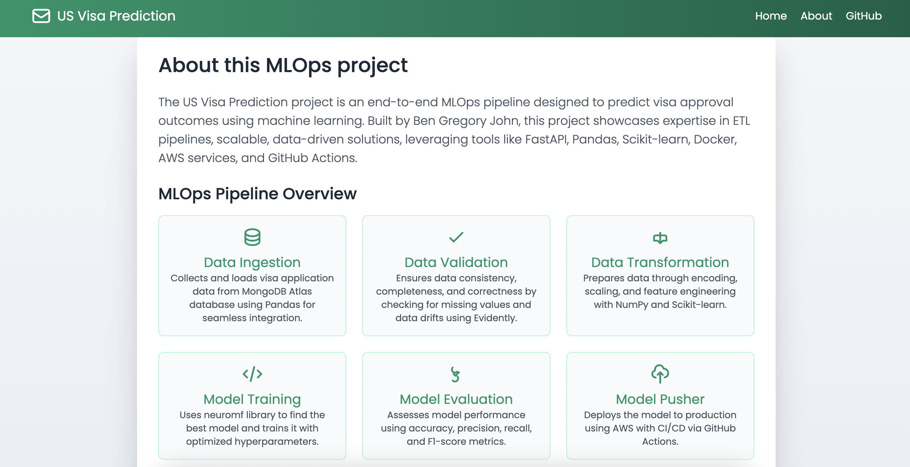
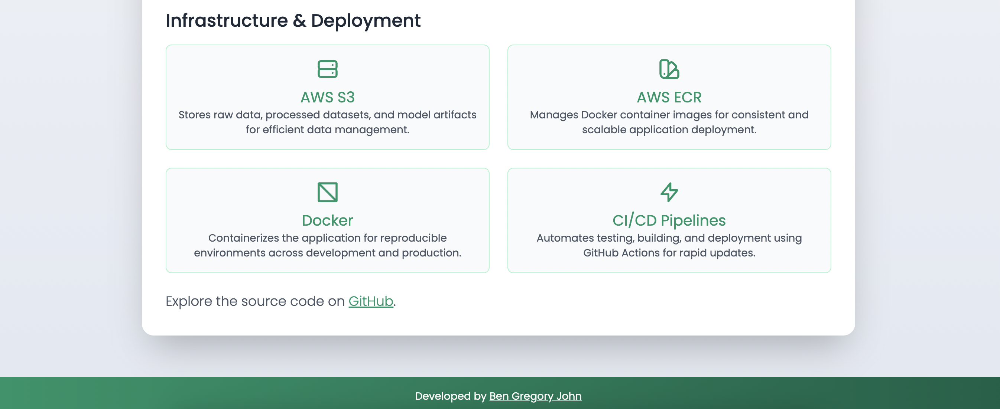

# US Visa Approval Prediction

This project aims to predict the approval of US visa applications using machine learning techniques. The dataset used for this project is sourced from Kaggle and contains various features related to visa applications. 

## Problem Statement

Given certain features of a visa application, the goal is to predict whether the application will be approved or not. This is a binary classification problem where the target variable is `approved` (1 for approved, 0 for not approved).

## Solution Scope

This can be used in real life by visa processing agencies to automate the initial screening of applications, thereby improving efficiency and reducing manual workload. Also US visa applicants can use this model to get an idea of their chances of approval based on historical data, so that they could improve their applications accordingly.

## Solution Proposal

We will build a machine learning model using the following steps:
1. **Load the dataset**: Import the necessary libraries and load the dataset.   
2. **Data Preprocessing**: Clean the data, handle missing values, and encode categorical variables.
3. **Exploratory Data Analysis (EDA)**: Analyze the data to understand the distribution of features and their relationship with the target variable.
4. **Feature Engineering**: Create new features if necessary, and select the most relevant features for the model.
5. **Model Building**: Split the data into training and testing sets, and build a machine learning model using algorithms like Logistic Regression, Decision Trees, or Random Forest, etc.
6. **Hyperparameter Tuning**: Optimize the model's performance by tuning hyperparameters using techniques like Grid Search or Random Search.
7. **Model Evaluation**: Evaluate the model's performance using metrics like accuracy, precision, recall, and F1-score.

---
## Introduction to MLOps ETL Pipeline
This project implements an MLOps ETL (Extract, Transform, Load) pipeline for the US Visa Approval Prediction task. The pipeline consists of several stages that ensure data quality, transformation, and model training.
The pipeline is designed to automate the process of data ingestion, validation, transformation, and model training, making it easier to manage and deploy machine learning models in production.

## Prediction System Overview

- Prediction System 



- Accepted vs Denied Response





- ETL Pipelines and Cloud Deployment





## Data Ingestion

We have implemented the first step of the MLOps pipeline: **Data Ingestion**. 

- Reads data from CSV files, serving as the initial data source.

- Performs a stratified train-test split to ensure balanced representation across classes.

- Organizes and saves artifacts, such as processed datasets, in a structured directory.

- Generates a `DataIngestionArtifact` that includes metadata and file paths for traceability.

#### Data Ingestion Flow

```
[Data Ingestion Config]
   |-- Data Ingestion Dir
   |-- Feature Store File Path
   |-- Training File Path
   |-- Testing File Path
   |-- Train-Test Split Ratio
   |-- Collection Name
	   |
	   v
[Initiate Data Ingestion] ---> (MongoDB)
	   |
	   v
[Export Data to Feature Store] ---> [usvisa.csv] ---> [Feature Store] ---> [Ingested]
	   |
	   v
[Split Data as Train and Test]
	   |
	   +--> [Data Ingestion Artifact] ---> [artifact folder]
	   +--> [train.csv]
	   +--> [test.csv]
```

#### Steps Completed

- Configured data ingestion parameters (directories, file paths, split ratio, collection name).
- Connected to MongoDB and exported the data to a local feature store as `usvisa.csv`.
- Split the data into training and testing sets based on the configured ratio.
- Saved the ingested artifacts (train/test CSVs) in the designated artifact folder for downstream tasks.

---

## Data Validation

We have implemented the second step of the MLOps pipeline: **Data Validation**.

- Ensures the integrity and quality of ingested data before it proceeds to further pipeline stages.

- Validates schema (column names, data types, missing values).

- Detects data drift between training and testing sets using the Evidently library.

- Saves validation reports and artifacts for traceability and monitoring.

#### Data Validation Flow

```
[Data Validation Config]
   |-- Schema File (schema.yaml)
   |-- Report File Path
   |-- Report Page Path
        |
        v
[Initiate Data Validation]
        |
        v
[Validate Dataset Schema]
   |-- Check Column Names
   |-- Check Data Types
   |-- Check Missing Values
        |
        v
[Detect Data Drift] ---> (Evidently Library)
        |
        v
[Generate Validation Reports]
   |-- JSON Report (report.json)
   |-- HTML Report (report.html)
        |
        v
[Data Validation Artifact] ---> [artifact folder]
```

#### Steps Completed

- Configured data validation parameters (schema file, report paths).
- Validated schema consistency of ingested train and test datasets.
- Used Evidently to detect and report data drift.
- Generated and saved both JSON and HTML validation reports.
- Stored the DataValidationArtifact in the artifact folder for downstream consumption.

---

## Data Transformation

The **Data Transformation** component prepares the data for modeling:

- Reads validated train and test datasets.
- Adds new features (e.g., `company_age`).
- Drops unnecessary columns as defined in the schema.
- Applies a transformation pipeline:
  - One-hot encoding for categorical features.
  - Ordinal encoding for ordered categories.
  - Power transformation and standard scaling for numerical features.
- Handles class imbalance using SMOTEENN.
- Saves the transformed datasets as numpy arrays and the transformation pipeline as an artifact.

#### Data Transformation Flow

```
[Validated Data] 
   |
   v
[Feature Engineering & Column Dropping]
   |
   v
[Preprocessing Pipeline: Encoding, Scaling, Transformation]
   |
   v
[SMOTEENN Balancing for Class Imbalance]
   |
   v
[Save Transformed Data & Preprocessor Artifact]
```

#### Steps Completed

- Engineered new features and dropped unnecessary columns.
- Applied preprocessing pipeline for encoding and scaling.
- Balanced the dataset using SMOTEENN.
- Saved transformed data and preprocessor for downstream tasks.

---

## Model Training

The **Model Training** component builds and evaluates the machine learning model:

- Loads the transformed train and test data.
- Uses a model factory (e.g., `neuro_mf`) to select and train the best model based on configuration and expected accuracy.
- Evaluates the model using accuracy, F1-score, precision, and recall.
- Saves the trained model and metrics as artifacts for downstream use.

#### Model Training Flow

```
[Transformed Train/Test Data]
   |
   v
[Model Selection & Training (ModelFactory) utilizing neuro_mf package]
   |
   v
[Model Evaluation: Accuracy, F1, Precision, Recall]
   |
   v
[Save Trained Model & Metrics Artifact]
```

#### Steps Completed

- Loaded transformed data for training and testing.
- Selected and trained the best model using the model factory.
- Evaluated model performance and saved metrics.
- Stored the trained model and metrics artifact for further pipeline stages.

---

## Setup Instructions

1. Clone the repository:
	```bash
	git clone <https://github.com/BenGJ10/US-Visa-Approval-Prediction.git>
	cd US-Visa-Approval-Prediction
	```
2. Create and activate a virtual environment:
	```bash
	python -m venv venv
	source venv/bin/activate
	```
3. Install dependencies:
	```bash
	pip install -r requirements.txt
	```
4. Set up environment variables (e.g., `MONGO_DB_URL`).

5. To run the pipeline:
	```bash
	python main.py
	```

---

**MORE MODULES ON THE WAY...**


